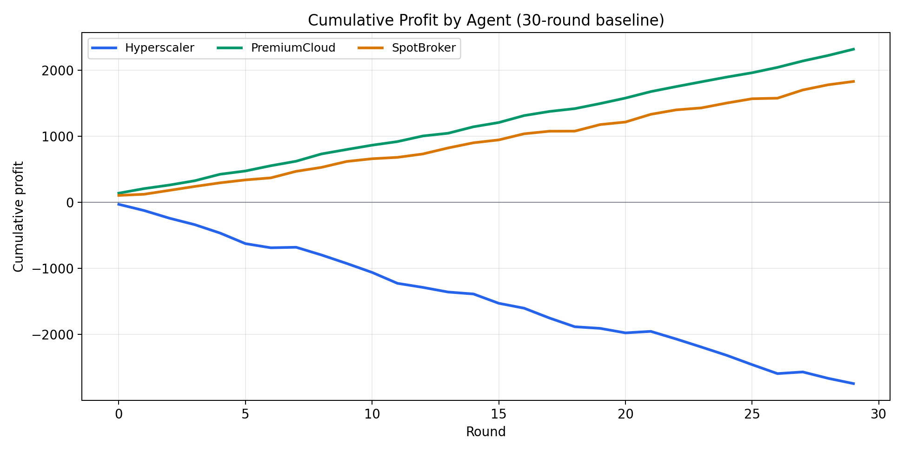
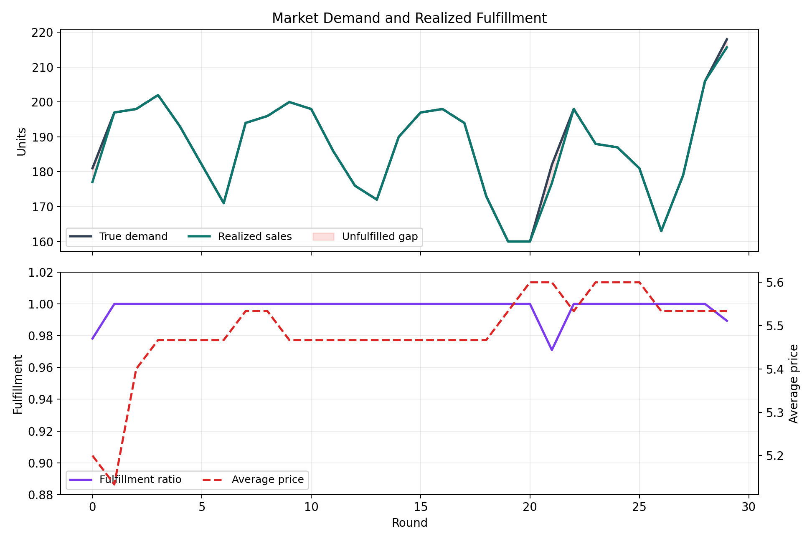
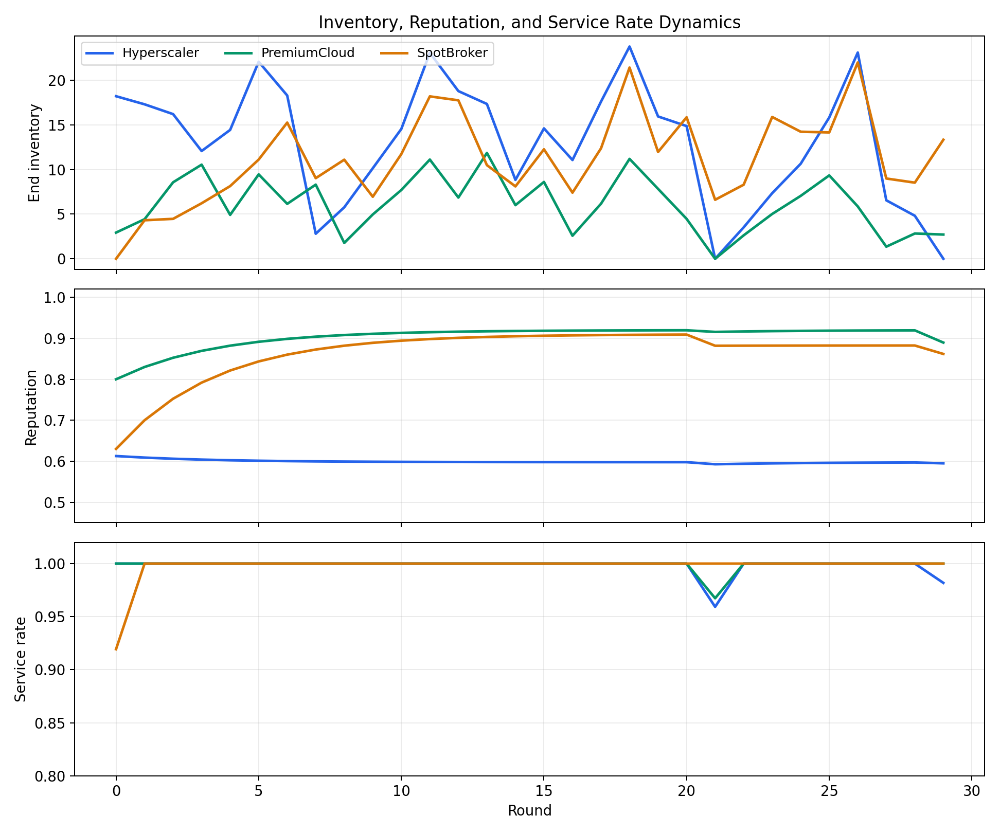
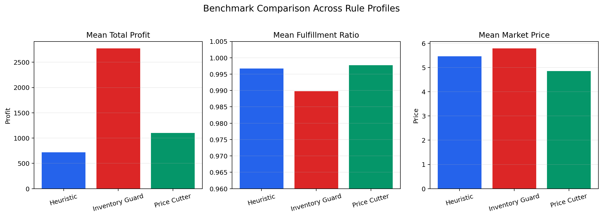
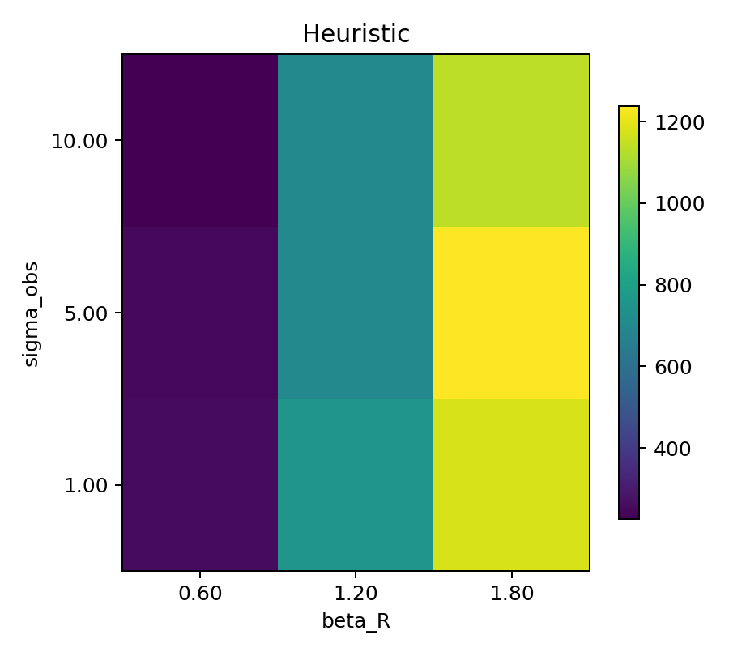

# PJ-AG4 项目中期报告

## 1. 项目概述

本项目面向高端 AI 算力芯片市场，构建一个由多个 Agent 参与的动态市场博弈仿真系统。项目将高端 GPU 算力节点抽象为标准化交易商品，例如 8 卡 H200 服务器节点，并模拟科技公司、AI 实验室和大模型公司对算力集群的周期性需求。

当前系统已经实现一个本地可运行、可复现的多 Agent 市场实验平台。市场中包含 3 个异质经营风格的供应商 Agent：规模主导型 Hyperscaler、稳健交付型 PremiumCloud、现货套利型 SpotBroker。每一轮中，Agent 根据有限市场观察决定需求预测、报价和新增可交付节点量，环境再根据价格、品牌、声誉、库存和同行拆借机制统一完成结算。

项目的核心研究目标是分析：不同经营风格 Agent 在重复竞争中的收益差异，时间序列需求波动对决策质量的影响，声誉机制对价格战和违约行为的约束，以及有限理性和信息不对称条件下市场是否会出现稳定格局、价格战或寡头分化。

## 2. 场景与模型设计

### 2.1 市场参与者

项目将市场设定为高端 GPU 算力节点现货与供应链分销市场。3 个 Agent 的经营画像如下：

| Agent | 角色定位 | 决策倾向 | 主要风险 |
| --- | --- | --- | --- |
| Hyperscaler | 规模主导型供应商 | 通过低价和大容量争夺市场份额 | 价格战、库存积压、利润波动 |
| PremiumCloud | 稳健交付型云服务商 | 依靠品牌、SLA 和声誉维持溢价 | 高价导致弱需求周期丢失份额 |
| SpotBroker | 现货套利型经纪商 | 灵活调价、轻库存、高周转 | 声誉和长期交付稳定性较弱 |

每轮中，Agent 选择报价 `p_i,t` 和新增节点量 `q_i,t`。市场环境根据总需求 `D_t` 分配订单，并根据库存、缺货、拆借、成本、折旧和声誉变化计算收益。

### 2.2 动态需求生成

市场需求采用时间序列方式生成，包含长期趋势、短周期和长周期季节项、外生冲击、自回归噪声和观测噪声。该设计使 Agent 无法直接看到完整真实需求，只能基于有限历史和带噪声的观察进行预测，从而体现有限理性。

需求生成逻辑已经实现于 `src/pj_ag4/timeseries.py`。当前默认参数包括：

- 基准需求：`180`
- 趋势增长：每轮 `0.6`
- 7 轮周期季节项和 30 轮周期季节项
- 冲击轮次：第 `35` 轮后触发
- 观测噪声：默认标准差 `5.0`

### 2.3 需求分配与结算机制

市场环境使用 logit 型吸引力函数分配需求。Agent 的吸引力由品牌强度、声誉和价格共同决定：

```text
attractiveness_i = brand_i + beta_R * reputation_i - beta_p * price_i
```

报价越低、品牌越强、声誉越高，Agent 获得的需求份额通常越大。分配后，如果某个 Agent 自身库存与新增供给不足，会先产生初始缺货；如果其他 Agent 存在富余供给，则触发同行算力拆借机制。

收益函数综合考虑以下项目：

- 客户交付收入
- 向同行转租算力的收入
- 向同行紧急拆借算力的成本
- 线性采购成本与凸性扩容成本
- 库存持有成本
- 技术折旧成本
- SLA 缺货惩罚
- 报价调整菜单成本

声誉被拆分为交付声誉、定价声誉和合作声誉，并按权重聚合为总声誉。该机制使 Agent 不能只追求单轮利润，还需要在价格战、违约和合作行为之间权衡长期后果。

## 3. 系统实现进展

### 3.1 总体架构

目前项目已经从最初的场景文档发展为完整的 Python 仿真系统。核心结构如下：

```text
src/pj_ag4/
  config.py              仿真、市场和 Agent 参数配置
  timeseries.py          动态需求生成
  environment.py         市场结算、拆借、库存、声誉和收益更新
  agents.py              启发式 Agent 与 LLM Agent 决策链
  core/runtime.py        逐轮运行时编排
  data/observation.py    有限理性市场观察构造
  dashboard.py           HTML dashboard 数据与模板渲染
  web.py                 localhost 交互式服务
quant/
  common.py              批量实验运行接口
  metrics.py             风险与收益指标
  reporting.py           CSV / Markdown 报告导出
  run_benchmarks.py      策略对照实验入口
  run_sensitivity.py     参数敏感性分析入口
```

仿真主流程为：

1. 需求生成器产生本轮真实需求和观测需求。
2. ObservationBuilder 为每个 Agent 构造有限历史观察。
3. Agent 输出本轮预测、价格和新增供给量。
4. MarketEnvironment 统一进行需求分配、拆借、结算和声誉更新。
5. 运行结果写入 CSV，并生成 PDF、HTML dashboard 和量化报告图表。

### 3.2 Agent 决策链

当前 Agent 不再只是一个单函数策略，而是拆分为四段式决策链：

```text
Forecaster -> Pricer -> Allocator -> RiskGate
```

其中 Forecaster 负责需求预测，Pricer 负责报价，Allocator 负责新增供给量，RiskGate 负责对价格、库存和声誉风险进行最后约束。三类 Agent 通过不同阶段风格组合形成差异：

| Agent | Forecaster | Pricer | Allocator | RiskGate |
| --- | --- | --- | --- | --- |
| Hyperscaler | momentum_chaser | share_grabber | capacity_expander | growth_tolerant |
| PremiumCloud | signal_smoother | premium_keeper | buffered_allocator | sla_guard |
| SpotBroker | volatility_reader | spread_hunter | inventory_light | inventory_guard |

这种结构提高了模型解释性：报告中可以把一次 Agent 行为解释为“预测如何形成、价格如何调整、库存如何配置、风险如何被约束”，而不是只展示一个黑箱动作。

### 3.3 LLM 后端

项目已经支持 OpenAI-compatible LLM 模式。LLM Agent 会收到角色身份、阶段风格、市场观察、历史价格、声誉、库存和合法动作范围，并返回 JSON 格式的 `forecast_demand`、`price`、`quantity`。如果模型输出格式异常或调用失败，系统会回退到启发式策略，保证仿真流程不中断。

当前中期阶段将 heuristic 作为正式 baseline，因为它无需网络和 API key，结果可复现；LLM 模式作为可切换后端和后续实验扩展方向。

## 4. 阶段性实验结果

本节采用 30 轮 baseline 仿真、20 轮多 seed benchmark 和参数敏感性扫描作为中期实验样例。实验命令如下：

```bash
python3 -m pj_ag4.cli --rounds 30 --seed 7 --output-dir reports/midterm/default_run

python3 quant/run_benchmarks.py \
  --rounds 20 \
  --seeds 7 11 23 \
  --strategies heuristic rule_price_cutter rule_inventory_guard \
  --output-root reports/midterm/benchmark

python3 quant/run_sensitivity.py \
  --rounds 20 \
  --seeds 7 11 \
  --strategies heuristic \
  --beta-r-values 0.6 1.2 1.8 \
  --sigma-obs-values 1.0 5.0 10.0 \
  --output-root reports/midterm/sensitivity
```

### 4.1 Baseline 结果

30 轮 baseline 仿真的市场总需求为 `5620.00`，总实现交付为 `5608.46`，整体履约率为 `0.9979`，市场总利润为 `1403.77`。这说明当前模型在默认参数下能够形成接近充分履约的市场，但 Agent 之间的收益结构明显分化。

| Agent | 累计利润 | 平均服务率 | 平均声誉 | 总缺货 | Dump 次数 | Default 次数 | 终局库存 |
| --- | ---: | ---: | ---: | ---: | ---: | ---: | ---: |
| Hyperscaler | -2745.48 | 0.9980 | 0.5988 | 6.76 | 30 | 0 | 0.00 |
| PremiumCloud | 2318.73 | 0.9989 | 0.9025 | 0.83 | 0 | 0 | 2.71 |
| SpotBroker | 1830.52 | 0.9973 | 0.8637 | 3.95 | 0 | 0 | 13.34 |

Hyperscaler 的服务率很高，但由于持续采用激进低价策略，触发了 30 次 dump 事件，最终累计利润为负。PremiumCloud 依靠高声誉和价格纪律获得最高累计利润。SpotBroker 在轻库存和灵活调价下保持较好利润，但仍存在一定缺货。



图 1 展示了 30 轮内各 Agent 的累计收益演化。Hyperscaler 从前期开始即承受亏损压力，而 PremiumCloud 和 SpotBroker 在中后段逐渐拉开正收益。



图 2 展示市场真实需求、实现交付和平均价格变化。整体未履约缺口较小，说明当前默认机制下同行拆借和库存调节能维持较高履约水平。



图 3 展示库存、声誉和服务率变化。PremiumCloud 声誉保持最高，SpotBroker 保持中等偏高声誉，Hyperscaler 因低价竞争受到定价声誉约束。

### 4.2 策略对照实验

benchmark 对比了三类策略配置：默认 heuristic、低价型 rule_price_cutter、库存保护型 rule_inventory_guard。20 轮、3 个 seed 的平均结果如下：

| 策略 | 平均市场总利润 | 平均履约率 | 平均市场价格 |
| --- | ---: | ---: | ---: |
| heuristic | 716.16 | 0.9967 | 5.460 |
| rule_price_cutter | 1102.02 | 0.9977 | 4.854 |
| rule_inventory_guard | 2772.93 | 0.9898 | 5.789 |



从结果看，库存保护型策略在当前参数下平均市场总利润最高，但履约率略低；低价型策略提高了销量和履约率，但压低了市场价格；默认 heuristic 处于二者之间。这说明模型能够呈现典型的市场经营权衡：价格纪律和库存克制提高利润，但可能牺牲部分服务水平。

### 4.3 敏感性分析

敏感性实验扫描了声誉权重 `beta_R` 和观测噪声标准差 `sigma_obs`。结果显示，声誉权重越高，默认 heuristic 市场的平均总利润和履约率总体越高。

最优三组结果集中在 `beta_R = 1.8`：

| beta_R | sigma_obs | 平均总利润 | 平均履约率 | 平均总缺货 |
| ---: | ---: | ---: | ---: | ---: |
| 1.8 | 5.0 | 1238.12 | 0.9980 | 2.50 |
| 1.8 | 1.0 | 1177.07 | 0.9974 | 3.25 |
| 1.8 | 10.0 | 1139.07 | 0.9977 | 2.88 |

较弱声誉权重 `beta_R = 0.6` 对应较低总利润和更高缺货。这说明声誉机制在当前模型中并非装饰项，而是能实质性约束低价竞争和违约风险，使市场从短期价格战转向长期交付质量竞争。



## 5. 当前完成度

中期阶段已经完成以下内容：

- 完成项目场景设计和实现文档栈。
- 完成 Python 仿真包结构和 CLI 入口。
- 实现动态需求生成、市场结算、库存折旧、缺货惩罚、同行拆借和声誉更新。
- 实现 3 个异质 Agent 的启发式 baseline。
- 实现 LLM 后端和启发式 fallback。
- 实现 CSV、PDF 图表、HTML dashboard 输出。
- 实现 `quant/` 批量 benchmark、敏感性分析和报告导出。
- 当前测试集通过，包含 27 个自动化测试。

从课程项目角度看，当前系统已经具备可演示、可复现、可量化分析的中期成果。相比单纯的理论建模，项目已经能跑出多轮交互数据，并能通过图表展示不同策略下的收益、履约、库存和声誉差异。

## 6. 存在问题与后续计划

当前主要限制包括：

- 长轮次 LLM 仿真依赖本地 OpenAI-compatible endpoint，稳定性受模型服务影响。
- Agent 内部阶段虽然已经拆分，但仍集中在 `agents.py` 中，后续可以继续模块化。
- 当前 benchmark 仍以 heuristic 和 rule-based 策略为主，LLM 多 seed 长跑还需要更稳定的推理端点。
- 报告自动生成能力已有基础，但图表叙事和实验解释还可以进一步增强。

后续计划如下：

1. 扩展 LLM 多轮实验，比较 heuristic 与 LLM Agent 在需求冲击、价格战和声誉约束下的行为差异。
2. 增加 ablation 实验，分别关闭声誉机制、拆借机制和库存折旧机制，观察市场结构变化。
3. 将 Agent 阶段进一步拆分为独立模块，增强可测试性和可替换性。
4. 丰富 dashboard 的交互控制，使用户可以实时调节需求冲击、Agent 模式和市场参数。
5. 将中期报告中的图表生成流程整理为最终报告的一键复现实验脚本。

## 7. 中期结论

PJ-AG4 当前已经完成从“高端 GPU 算力市场博弈设想”到“可运行多 Agent 仿真系统”的关键转化。系统不仅实现了价格、需求、库存、履约和声誉等基础机制，还通过阶段式 Agent 决策链和量化实验层提供了较强的解释性与可复现性。

阶段性结果表明，声誉机制能够有效改变市场竞争结构：当声誉权重提高时，市场平均利润和履约水平均改善；而过度低价竞争虽然能提高份额，却可能损害定价声誉和长期收益。这一结果与项目最初关于“有限理性、声誉约束和重复博弈会影响市场稳定格局”的研究目标一致。

因此，中期阶段的主要目标已经达成。后续工作重点将从“让系统跑起来”转向“让实验更系统、让 LLM 对照更充分、让最终报告更有说服力”。
